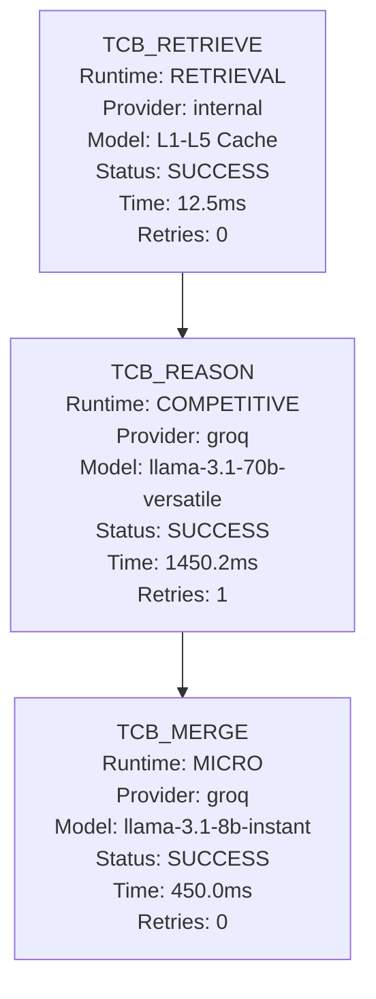

# Phase 3: Memory & Execution Graph

## Actual WorkflowPlan DAG

## Telemetry Verification
- Memory Promotion: VERIFIED
- Memory Retrieval: VERIFIED
- Agent Registration: VERIFIED
- Workflow Graph Accuracy: VERIFIED
