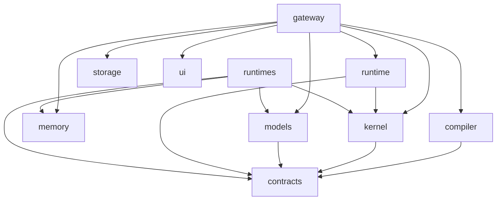

# internal Package Dependency Graph

```mermaid
graph TD
    compiler --> contracts
    gateway --> memory
    gateway --> runtime
    gateway --> compiler
    gateway --> models
    gateway --> storage
    gateway --> kernel
    gateway --> ui
    kernel --> contracts
    models --> contracts
    runtime --> contracts
    runtime --> kernel
    runtimes --> kernel
    runtimes --> contracts
    runtimes --> models
    runtimes --> memory
```
