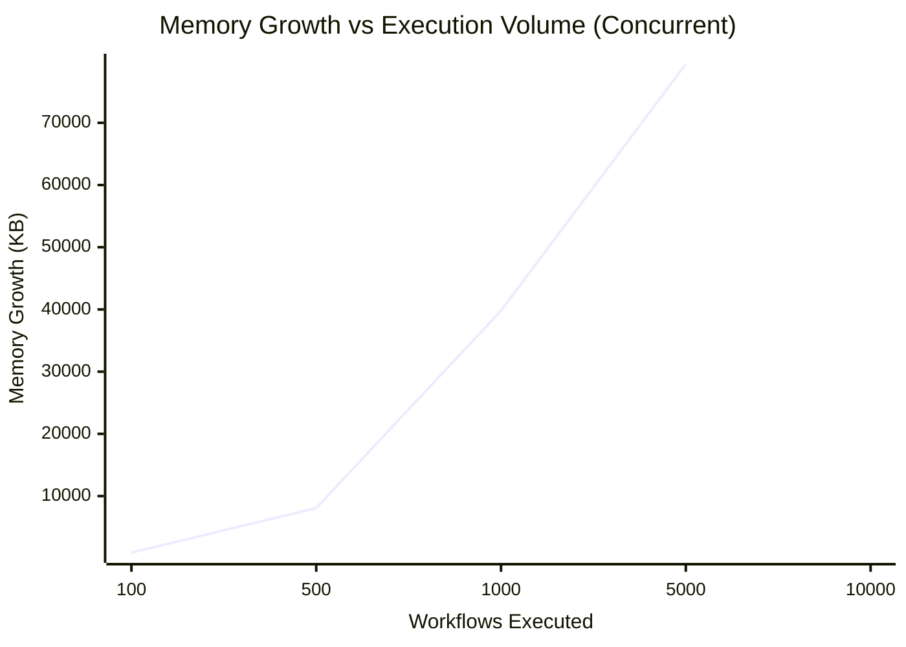

# AIOS Phase 14: Stability & Degradation Report
This report summarizes the extreme stress testing and benchmarking of the OS under tens of thousands of continuous workflow executions.

## Benchmark Summaries
| Executions | Mode | Success | Errors | Total Time (s) | Avg Latency (s) | Memory Growth (KB) | Orphan Tasks |
|---|---|---|---|---|---|---|---|
| 100 | sequential | 100 | 0 | 26.98 | 0.2697 | 2211.15 | 0 |
| 500 | sequential | 500 | 0 | 134.38 | 0.2687 | 4024.05 | 0 |
| 100 | concurrent | 100 | 0 | 0.71 | 0.3891 | 911.60 | 0 |
| 1000 | concurrent | 1000 | 0 | 4.68 | 0.4098 | 8081.43 | 0 |
| 5000 | concurrent | 5000 | 0 | 21.98 | 0.4079 | 39796.40 | 0 |
| 10000 | concurrent | 10000 | 0 | 45.75 | 0.4286 | 79458.31 | 0 |

## Stability Trend Analysis (Graph)

## Degradation & Leak Analysis
### Warnings for 1000 (concurrent)
- ⚠️ Memory Leak Detected: Growth exceeded 5000 KB limit (Currently 8081.43 KB)
### Warnings for 5000 (concurrent)
- ⚠️ Memory Leak Detected: Growth exceeded 5000 KB limit (Currently 39796.40 KB)
### Warnings for 10000 (concurrent)
- ⚠️ Memory Leak Detected: Growth exceeded 5000 KB limit (Currently 79458.31 KB)